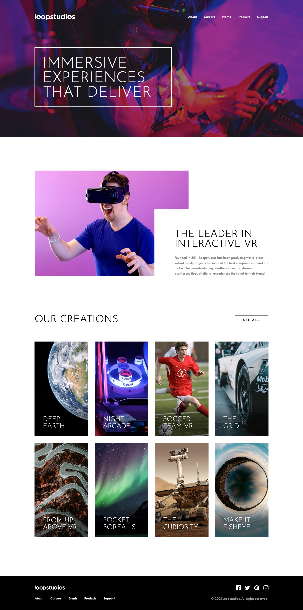

# Frontend Mentor - Loopstudios Landing Page Solution
This is a solution to the [Loopstudios Landing Page challenge on Frontend Mentor](https://www.frontendmentor.io/challenges/loopstudios-landing-page-N88J5Onjw). Frontend Mentor challenges help you improve your coding skills by building realistic projects. 

## The challenge
Users should be able to:
- View the optimal layout for the site depending on their device's screen size
- See hover states for all interactive elements on the page

## Screenshot
### Mobile


### Desktop


## Built with
- Semantic HTML5 markup
- Flexbox
- CSS Grid
- Mobile-first workflow
- SASS
- BEM
- jQuery

## What I learned

I used jQuery for the first time in this project. I can see the advantage of using it over regular JavaScript as it allows you to target HTML elements and alter them using fewer lines of code. It was a gentle introduction to jQuery because I only really utilised it for the navigation menu which wasn't too complicated:
```js
let isAnimating = false;

$('.nav__toggle').on('click', function() {
    // User cannot toggle navigation menu while animation is running
    if (isAnimating) return;

    isAnimating = true;

    // Toggle true/false for aria-expanded attribute
    $(this).attr('aria-expanded', (_, attr) => attr === 'false');

    // Toggle 'open-nav' class on body element
    $('body').toggleClass('open-nav');

    // After 700ms, user may toggle the navigation menu again
    setTimeout( () => isAnimating = false, 700);
});
```

I also used SASS for this project and I was particularly pleased with a mixin I created for the focus state for anchor elements. This mixin was only necessary because Safari does not support `:focus-visible`. Without this pseudo-class, anchor elements will receive focus when clicked which is not what I wanted; I only wanted the anchor elements to be focused via the keyboard. Because of Safari's lack of support, a lot more code was required and therefore a mixin made sense here:
```css
@mixin focus($color: currentColor, $border-width: -$line-width) {
    &:focus {
        outline: $line-width dashed $color;
        outline-offset: $border-width;
    }

    &:focus:not(:focus-visible) { outline: none; }

    &:focus-visible {
        outline: $line-width dashed $color;
        outline-offset: $border-width;
    }
}
```

## Continued development
I am going to continue learning jQuery and perhaps revisit older projects to rework them with jQuery. In particular there was a challenge where I created an accordion; I did it with Bootstrap which felt like cheating and now I want to see if I can create a functioning accordion with jQuery instead.